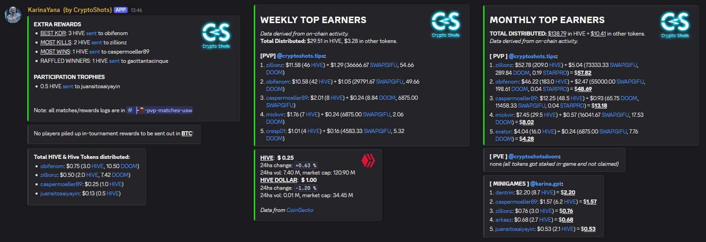

&nbsp;

## Contents

- [Hive Rewards](#hive-rewards)
- [Usage - NodeJS and Browser](#usage---nodejs-and-browser)
- [Usage - CLI](#usage---cli)
- [Configuration](#configuration)
- [Peakd's Beacon Wrapper](#peakds-beacon-wrapper)
- [Usage in Crypto Shots](#usage-in-crypto-shots)

-----

# Hive Rewards

An SDK for Node.js and the browser, and a command-line tool to scan HIVE, HBD, and Hive-Engine token transfers:

- **Inbound** - sum HIVE, HBD, and token rewards plus USD value received by specified accounts, tracking specific sender accounts.
- **Outbound** - map all recipients plus HIVE, HBD, token, and USD values sent by a given sender.

---

## Usage - NodeJS and Browser

```js
import { hiveRewards } from 'hiverewards';

const analyzer = await hiveRewards({ verbose: true });

const inbound = await analyzer.inbounds({
  receivers: ['zillionz', 'obifenom'],
  hiveSenders: { PVP_HIVE: 'cryptoshots.tips' },
  tokenSenders: { PVP_TOKENS: 'cryptoshots.tips' },
  hours: 2,
});
console.log(inbound);

const outbound = await analyzer.outbounds({
  senders: ['cryptoshots.tips', 'karina.gpt'],
  ignoredReceivers: ['keychain.swap'],
  days: 1,
});
console.log(outbound);
```

#### Self-hosted bundle

1. Clone the project.
2. Build it with:

```bash
npm run build:web
```

3. Host the generated `dist` folder on your server.
4. Import it in your frontend:

```html
<script src="dist/hiverewards.bundle.js"></script>
<script>
  (async () => {
    const analyzer = await window.HiveRewards.hiveRewards();
    const result = await analyzer.inbounds({
      receivers: ['obifenom'],
      hiveSenders: { PVP_GAME_REWARDS: 'cryptoshots.tips' },
      days: 7,
    });
    console.log(result);
  })();
</script>
```

-----

## Usage - CLI

```bash
git clone <repo>
cd <repo>
npm install
```

```bash
npm start -- --inbound obifenom zillionz --from pvpRewards=cryptoshots.tips pveRewards=cryptoshotsdoom --hours 24
```


```bash
npm start -- --outbound cryptoshots.tips karina.gpt --days 1
```


Append `--verbose` for verbose logging.

-----

## Configuration

| Env var | Default |
|---|---|
| `HIVE_PRICE_URL` | `https://api.coingecko.com/api/v3/simple/price?ids=hive,hive_dollar&vs_currencies=usd` |

You can also override the initial Hive / Hive Engine node by passing a config object to the `hiveRewards()` factory in code:

```js
const analyzer = await hiveRewards({
  hiveNodeUrl: 'https://your.hive.node',
  hiveEngineRpcUrl: 'https://your.he.rpc',
  hiveEngineHistoryUrl: 'https://your.he.history',
});
```

### Other Overrides

| Constructor Attribute | Description | Default |
|---|---|---|
| `fetch` | Fetch API implementation | `npm cross-fetch` |
| `hiveJs` | Pass in another `@hiveio/hive-js` version if needed | `v2` |
| `log` | Custom logger | `console` |
| `apiCallsDelay` | Default wait time for API call retries | `500` |
| `priceCacheMins` | How long Hive/HBD prices are cached for | `10 mins` |
| `hiveHistoryLimit` | Max account-history ops per Hive call | `500` |
| `heHistoryLimit` | Max Hive-Engine history records per call | `250` |

---

# Peakd's Beacon Wrapper

Wrapper for [@peakd](https://peakd.com/@peakd)'s [Beacon](https://beacon.peakd.com) APIs.

**Usage:**

```js
import { peakdBeaconWrapper } from 'hiverewards';

const { getHealthyHiveNode, getHealthyHeNode, getHealthyHeHistoryNode } = peakdBeaconWrapper;
const hiveUrl = await getHealthyHiveNode();
const heUrl = await getHealthyHeNode();
const hehUrl = await getHealthyHeHistoryNode();

hiveApi.api.setOptions({ url: hiveUrl });
```

You can also use the Hive / Hive Engine client wrappers that automatically rotate healthy nodes:

```js
import { healthyApisWrapper } from 'hiverewards';

const { hiveApiCall, hiveEngineApiCall, hiveEngineHistoryApiCall } = healthyApisWrapper;

const history = await hiveApiCall('getAccountHistory', ['cryptoshotsdoom', -1, 10]);
console.log(history);

const metrics = await hiveEngineApiCall({
  jsonrpc: '2.0',
  method: 'find',
  params: {
    contract: 'market',
    table: 'metrics',
    query: { symbol: 'DOOM' },
    limit: 1,
    offset: 0,
  },
  id: 1,
});
console.log(metrics);

const heHistory = await hiveEngineHistoryApiCall('cryptoshotstips', 20);
console.log(heHistory);
```

---

## Usage in Crypto Shots

**[DISCORD](https://crypto-shots.com/discord):**

- Earnings report for daily tournaments
- Weekly/monthly top earners leaderboard



---

## Support us

- [VOTE](https://vote.hive.uno/@crypto-shots) for our witness
- Use the [Issues](https://github.com/Crypto-Shots/Hive-Rewards/issues) tab to report bugs
- Create [Merge Requests](https://github.com/Crypto-Shots/Hive-Rewards/pulls) for improvements and fixes
